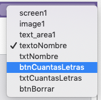
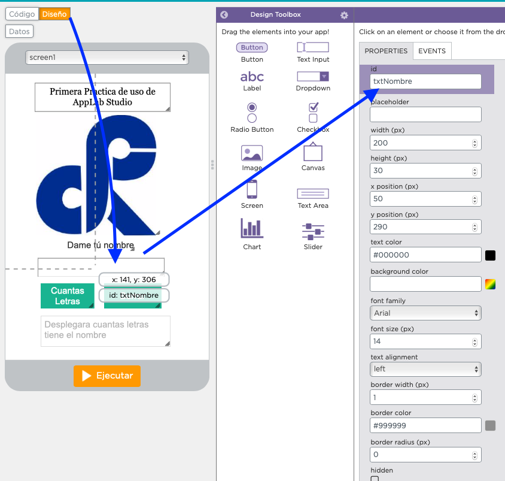
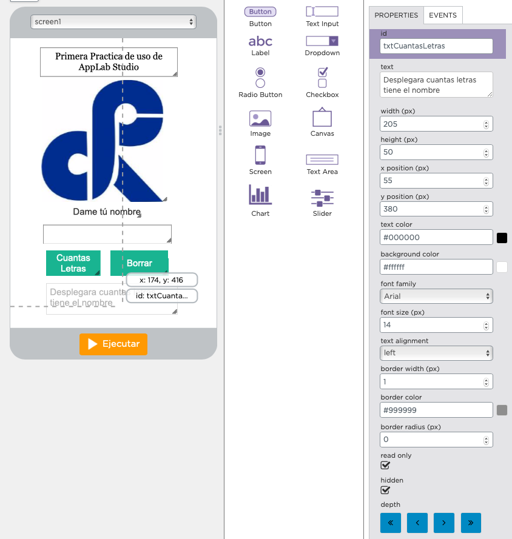

Esta practica es básica pues organiza un diseño de interface (UI), hay botones de acción, áreas de texto y despligue con propiedades de ocultar


# DISEÑO DEL UI (USER INTERFACE O INTERFAZ DEL USUARIO)
## 

Acomodamos los elementos y ponemos las propiedades de manera general sin preocuparnos de colores o tipos de letra; una vez que funcione su App, ya tendrá tiempo para acondicionarla darle belleza en todos los aspectos.




Son los bloques que estaremos usando


Definimos con las iniciales "txt" pues es recibiá un texto capturado, de ser  numero iniciamos con "int" (num integro entero):
txtCorreoElectronico, intEdad, intWhatzap; cabe hacer notar que iniciamos con minusculas y por cada composición ponemos una mayúsculas; se donomina CamelCase (como Camello)*



Es una propiedad que esta OCULTA y esta manualmente se aparece si hay algo que decirle al usuario de la APP, de lo contrario aparece escondido.

```
/**
                                 
,------. ,------.,--.    ,-----. 
|  .--. '|  .---'|  |   '  .--./ 
|  '--' ||  `--, |  |   |  |     
|  | --' |  |`   |  '--.'  '--'\ 
`--'     `--'    `-----' `-----'

Área de Código Fuente para el formulario UI sencillo

POR: René Solis
Fecha: 5-3-19
Notas:  Para uso de estudiantes PFLC Bloque I de Informática.

**/

onEvent("btnCuantasLetras", "click", function(event) {
  // console.log("btnCuantasLetras clicked!");
  // Checamos si tiene algo el btnNombre
  //
  var txtNombre = getText("txtNombre");
  var intCuantasLetras = 0;
  
  // Esta validacion pregunta si hay algo capturado de lo contrario lo salta.
  if (txtNombre.length > 1) {
    console.log("No esta vacio");
    intCuantasLetras = txtNombre.length;
    
    // Desplegar numero de letras
    setText("txtCuantasLetras", "Cuenta con "+ intCuantasLetras +" caracteres el nombre");
    showElement("txtCuantasLetras");
    
  } 
});

//Boton para Borrar el Formulario
onEvent("btnBorrar", "click", function(event) {

  // Desplegar numero de letras
  setText("txtCuantasLetras", " ");
  setText("txtNombre", " ");
  hideElement("txtCuantasLetras");
     
});
```

#*NOTAS:

**CamelCase** es un estilo de escritura que se aplica a frases o palabras compuestas. El nombre se debe a que las mayúsculas a lo largo de una palabra en CamelCase se asemejan a las jorobas de un camello. El nombre CamelCase se podría traducir como Mayúsculas/Minúsculas Camello. El término case se traduce como "caja tipográfica", que a su vez implica si una letra es mayúscula o minúscula.

Existen dos tipos de CamelCase:

**lowerCamelCase, igual que la anterior con la excepción de que la primera letra es minúscula. Ejemplo: ejemploDeLowerCamelCase.**
UpperCamelCase, cuando la primera letra de cada una de las palabras es mayúscula. Ejemplo: EjemploDeUpperCamelCase.
