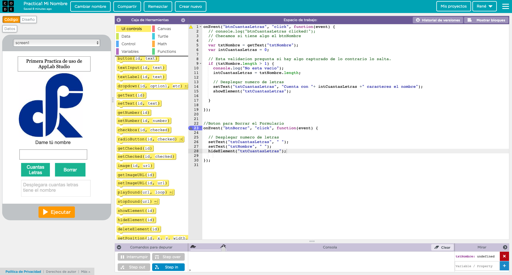

CONCEPTOS GENERALES INFORMATICA II

> Problema: Cuestión que se plantea para hallar un dato desconocido a partir de otros datos conocidos, o para determinar el método que hay que seguir para obtener un resultado dado.

> Algoritmo: Conjunto ordenado de operaciones sistemáticas que permite hacer un cálculo y hallar la solución de un tipo de problemas.

> Diagrama de flujo:es la representación gráfica de un algoritmo o proceso. Se utiliza en disciplinas como programación, economía, procesos industriales y psicología cognitiva.

__Coloca en el paréntesis de la izquierda la opción que corresponde correctamente.__

1. ( ) Se puede considerar como una situación en la que se plantea una tarea o interrogante que se trata de resolver.

6) Solución   b) Problema   c) Algoritmo d) Diagrama

2. () Es la información que te provee un problema

a) Condiciones b] Requerimientos c) Algoritmo d) Metodología

3. () Es la tarea o interrogante que plantea el problema

a) Condiciones  b)Requerimientos c) Algoritmo

4.( )Lista de pasos o instrucciones donde se especifica la sucesión lógica de operaciones necesarias para resolver cualquier problema

a) Solución b) Problema c] Algoritmo

5.( ) Característica de un algoritmo que nos indica que debemos evitar ambigüedad en un algoritmo

a) Debe ser finito b] Debe ser definido c) Debe ser efectivo d] Debe ser general

6.( ) Característica de un algoritmo que nos indica que éste debe poder aplicarse a cualquier problema de la misma clase

a) Debe ser infinito b) Debe ser definido c) Debe ser efectiva d) Debe ser general

7.() Representación gráfica del flujo de la información que contiene un algoritmo
a) Solución b) Problema c) Algoritmo d) Diagrama de flujo

8.( ) Etapa para resolver un problema en la que se analiza la entrada y la salida

a) desarrollo de la solución      b)diseño del algoritmo                                             c)planteamiento de alternativas de solución     d)identificación del problema 

9.( ) Etapa para resolver problemas en la que la solución se debe plantear como una serie de pasos
a)desarrollo de la solución      b)diseño del algoritmo                                             c)planteamiento de alternativas de solución     d)identificación del problema 

10.( ) Etapa para resolver problemas en la cual se deben generar caminos diversos y creativos.
a)desarrollo de la solución      b)diseño del algoritmo                                             c)planteamiento de alternativas de solución     d)identificación del problema 

